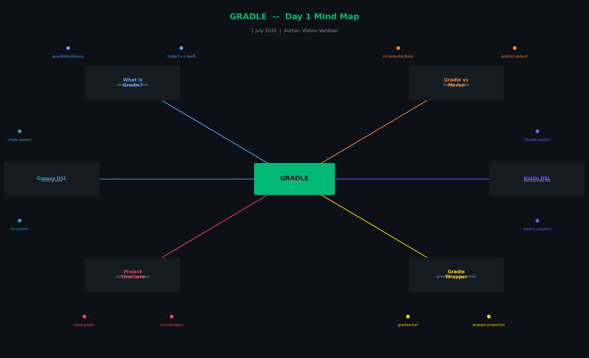
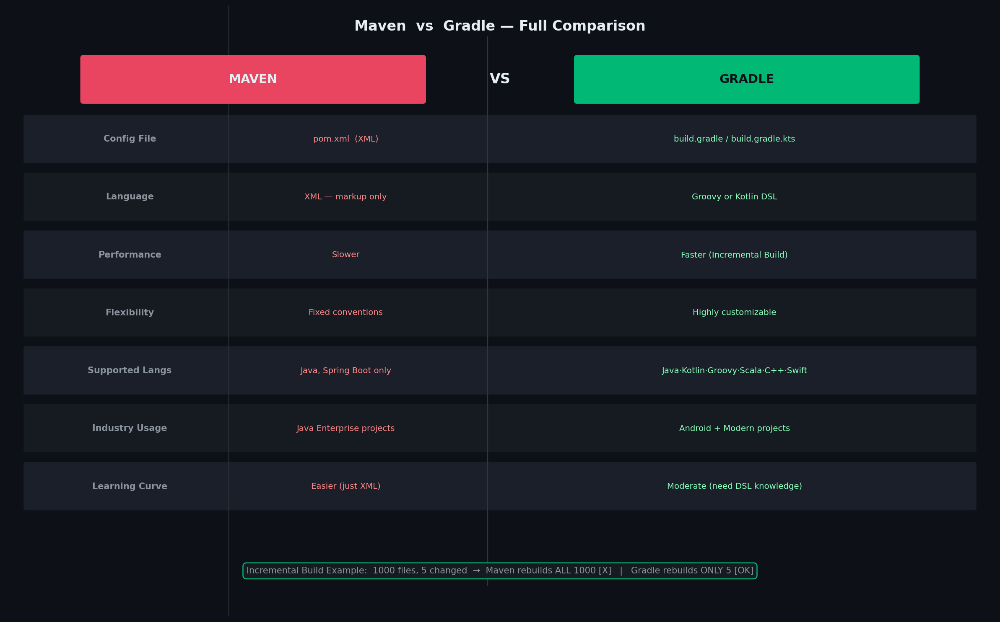
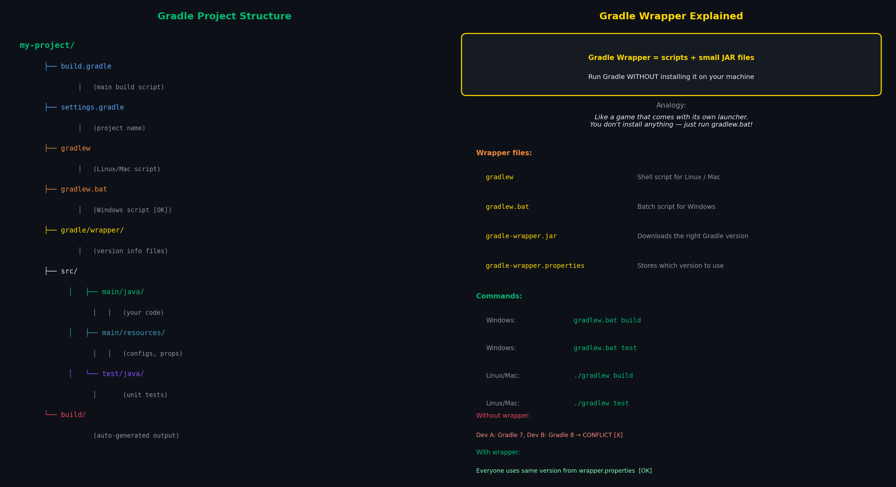
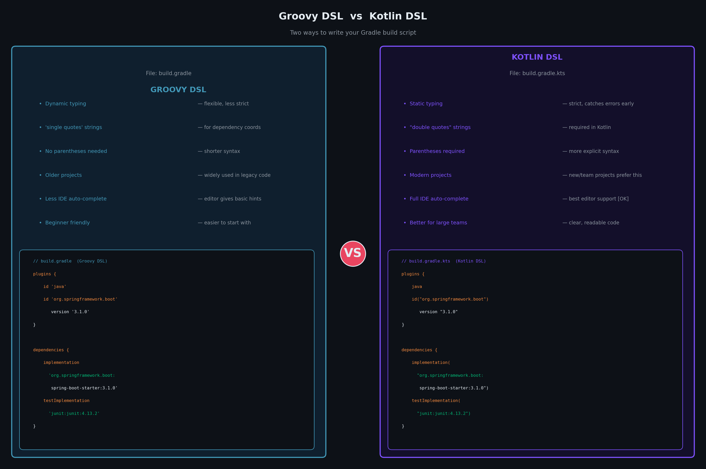

# 📗 Day 1 — Gradle Build Tool
**Date:** 1 July 2026  
**Topic:** What is Gradle, Gradle vs Maven, Groovy DSL vs Kotlin DSL, Project Structure, Gradle Wrapper

---

## Mind Map



---

## 1️⃣ What is a Build Tool?

> A **build tool** is software that **automates the process of building your project**.

### "Building" means:

| Step | What happens |
|------|-------------|
| 🔨 Compile | Source code (Java) → Bytecode (`.class`) |
| 📦 Package | Code into JAR / WAR files |
| 📚 Manage Dependencies | Gets external libraries like Hibernate, Spring, etc. |
| 🧪 Run Tests | Executes all your test cases |
| 🚀 Deploy | Puts the application on a server |

### Simple Analogy:
> 🏗️ Building a house manually = carrying bricks one by one, mixing cement yourself  
> Using a **build tool** = a construction machine that does it all automatically

When you build your project, the output is packaged into a **JAR or WAR** file that:
- Bundles your code **plus all dependencies**
- Can be **run directly** without extra setup

---

## 2️⃣ What is Gradle?

Gradle is a **free, open-source build automation tool** that:
- Is **more flexible and faster** than Maven
- Uses a **programming language** (Groovy or Kotlin) instead of XML for configuration
- Is the **default build tool for Android** projects
- Supports many languages: **Java, Kotlin, Groovy, Scala, C++, Swift**

> Maven is for **only Java and Spring Boot**, but Gradle supports:
> Java · Kotlin · Groovy · Scala · C++ · Swift

---

## 3️⃣ Maven vs Gradle — Side by Side



### Why is Gradle Faster? (Simple Example)

> Imagine there are **1000 files** in your project, and **some of them are different** (changed).

```
MAVEN:
  You change 5 files out of 1000
  Maven re-executes ALL 1000 files  ← wasteful!

GRADLE:
  You change 5 files out of 1000
  Gradle rebuilds ONLY those 5 changed files ✅ ← SMART!
```

This is called **Incremental Build** — Gradle only rebuilds what changed.  
That's why Gradle is **faster compared to Maven**.

---

## 4️⃣ Build Command Differences

| Task | Maven Command | Gradle Command |
|------|--------------|----------------|
| Clean | `mvn clean` | `gradle clean` |
| Build | `mvn package` | `gradle build` |
| Run Tests | `mvn test` | `gradle test` |
| Run Spring Boot | `mvn spring-boot:run` | `gradle bootRun` |

---

## 5️⃣ Gradle in CMD — Basic Commands

```bash
gradle init       # Create a new Gradle project
gradle tasks      # List all available tasks
gradle run        # Run the project
gradle build      # Build the project (compile + test + package)
gradle clean      # Delete the build/ folder
gradle test       # Run unit tests
```

> ⚠️ `gradle run` works only when Gradle is **installed locally**.  
> Use `gradlew.bat` to run **without installing Gradle** (explained below).

---

## 6️⃣ Gradle Project Folder Structure



### Comparison with Maven:
```
Maven                         Gradle
─────────────────────────     ─────────────────────────
pom.xml               →       build.gradle
src/main/java         →       src/main/java  (same!)
src/test/java         →       src/test/java  (same!)
target/               →       build/
```

---

## 7️⃣ Gradle Wrapper

### What is Gradle Wrapper?

> **Gradle Wrapper** = a set of scripts + small JAR files that allow you to **run Gradle without installing Gradle manually** on your system.

### Simple Analogy:
> 🎮 Imagine a game that comes with its own launcher.  
> You don't need to install anything — just click the launcher and it runs.  
> **Gradle Wrapper = that launcher** for your project.

### Files in the wrapper:
```
gradlew          ← Shell script for Linux/Mac
gradlew.bat      ← Batch script for Windows ✅
gradle/
└── wrapper/
    ├── gradle-wrapper.jar        ← Downloads the right Gradle version
    └── gradle-wrapper.properties ← Stores which Gradle version to use
```

### How to use it:

```bash
# Windows
gradlew.bat build
gradlew.bat test
gradlew.bat clean

# Linux / Mac
./gradlew build
./gradlew test
./gradlew clean
```

> ✅ We need to make sure Gradle application is running globally to use `gradlew.bat`  
> But if not installed globally, `gradlew.bat` **downloads the correct Gradle version automatically**!

### Why wrapper is important:
```
WITHOUT wrapper:                  WITH wrapper:
  Developer A: Gradle 7.0   →     Everyone uses the SAME version
  Developer B: Gradle 8.0   →     defined in wrapper.properties ✅
  Developer C: Gradle 6.5   →     No version conflicts!
  Result: CONFLICTS! ❌
```

---

## 8️⃣ Groovy DSL vs Kotlin DSL




> **DSL = Domain Specific Language** — a mini-language designed for a specific purpose.  
> Gradle lets you write your build script in **two languages**: Groovy or Kotlin.

---

### 🟡 Groovy DSL — `build.gradle`

**Groovy** is a dynamic scripting language that runs on the JVM (Java Virtual Machine).

Think of Groovy like:
> 📝 Writing build instructions in a **relaxed, flexible way** — like a rough draft.  
> It's forgiving, short, and quick to write.

#### File name: `build.gradle`

```groovy
// build.gradle (Groovy DSL)

plugins {
    id 'java'                           // Add Java support
    id 'org.springframework.boot' version '3.1.0'
}

group = 'com.vishnu'                    // GroupId
version = '1.0-SNAPSHOT'               // Version

repositories {
    mavenCentral()                      // Download from Maven Central
}

dependencies {
    // Spring Boot Web
    implementation 'org.springframework.boot:spring-boot-starter-web:3.1.0'

    // JUnit for testing
    testImplementation 'junit:junit:4.13.2'

    // Hibernate
    implementation 'org.hibernate:hibernate-core:6.2.0.Final'
}
```

**Groovy Characteristics:**
- Uses **single quotes** `'...'` for strings (mostly)
- **No semicolons** needed
- **Optional parentheses** in some places
- More **flexible/dynamic** — less strict
- Older style, widely used in existing projects

---

### 🔵 Kotlin DSL — `build.gradle.kts`

**Kotlin** is a modern, statically-typed language made by JetBrains (the makers of IntelliJ).

Think of Kotlin DSL like:
> 📋 Writing build instructions in a **strict, professional way** — like a final typed document.  
> Your IDE catches mistakes immediately, everything is precise.

#### File name: `build.gradle.kts` (notice the `.kts` extension!)

```kotlin
// build.gradle.kts (Kotlin DSL)

plugins {
    java                                         // Add Java support
    id("org.springframework.boot") version "3.1.0"
}

group = "com.vishnu"                             // GroupId
version = "1.0-SNAPSHOT"                         // Version

repositories {
    mavenCentral()                               // Download from Maven Central
}

dependencies {
    // Spring Boot Web
    implementation("org.springframework.boot:spring-boot-starter-web:3.1.0")

    // JUnit for testing
    testImplementation("junit:junit:4.13.2")

    // Hibernate
    implementation("org.hibernate:hibernate-core:6.2.0.Final")
}
```

**Kotlin DSL Characteristics:**
- Uses **double quotes** `"..."` for strings
- **Parentheses are required** `("...")`
- **Statically typed** — IDE gives you auto-complete and error highlighting
- **More strict** — catches errors before you even run
- Modern style, recommended for new projects

---

### 🆚 Groovy vs Kotlin DSL — Full Comparison

```
┌─────────────────────────────────────────────────────────────────────┐
│              Groovy DSL  vs  Kotlin DSL                             │
├────────────────────────────┬────────────────────────────────────────┤
│       GROOVY DSL           │         KOTLIN DSL                    │
├────────────────────────────┼────────────────────────────────────────┤
│ File: build.gradle         │ File: build.gradle.kts                │
│ Language: Groovy           │ Language: Kotlin                      │
│ Dynamic typing             │ Static typing (stricter)              │
│ Less IDE support           │ Full IDE auto-complete ✅              │
│ Shorter, flexible syntax   │ More explicit, verbose syntax         │
│ Older projects use this    │ New/modern projects prefer this       │
│ 'single quotes' for strings│ "double quotes" for strings           │
│ Optional parentheses       │ Parentheses required                  │
│ Harder to catch typos      │ Errors caught at compile time ✅       │
│ More beginner-friendly     │ Better for large teams                │
└────────────────────────────┴────────────────────────────────────────┘
```

### Same thing written in both — spot the difference:

```groovy
// GROOVY DSL (build.gradle)
dependencies {
    implementation 'org.springframework.boot:spring-boot-starter-web:3.1.0'
    testImplementation 'junit:junit:4.13.2'
}
```

```kotlin
// KOTLIN DSL (build.gradle.kts)
dependencies {
    implementation("org.springframework.boot:spring-boot-starter-web:3.1.0")
    testImplementation("junit:junit:4.13.2")
}
```

**Key difference:** Groovy uses no parentheses + single quotes. Kotlin uses parentheses + double quotes. That's it!

### Which one should you use?

```
Starting a NEW project?         → Use Kotlin DSL (build.gradle.kts) ✅
Working on an EXISTING project? → Stick with whatever it uses
Learning Gradle for the first time? → Groovy DSL is simpler to start
Working in a TEAM?              → Kotlin DSL (better IDE support)
Android project?                → Kotlin DSL (Google recommends it)
```

---

## 9️⃣ Gradle Supports More Languages Than Maven

```
           MAVEN                        GRADLE
     ─────────────────          ─────────────────────────
          Java ✅                     Java ✅
       Spring Boot ✅                 Kotlin ✅
                                      Groovy ✅
                                      Scala ✅
                                      C++ ✅
                                      Swift ✅
                                   Spring Boot ✅
                                    Android ✅
```

---

## 🔑 Quick Reference Card

| Concept | Groovy DSL | Kotlin DSL |
|---------|-----------|------------|
| File name | `build.gradle` | `build.gradle.kts` |
| Language | Groovy | Kotlin |
| String quotes | `'single'` | `"double"` |
| Function calls | `implementation 'x'` | `implementation("x")` |
| Typing | Dynamic | Static |
| IDE support | Basic | Full auto-complete |
| Best for | Legacy/simple projects | Modern/team projects |

| Command | What it does |
|---------|-------------|
| `gradle init` | Create new project |
| `gradle build` | Compile + test + package |
| `gradle clean` | Delete build/ folder |
| `gradle test` | Run unit tests |
| `gradle tasks` | List all tasks |
| `gradlew.bat build` | Build without Gradle installed (Windows) |
| `./gradlew build` | Build without Gradle installed (Linux/Mac) |

---

*📅 Tomorrow: More Gradle concepts...*
