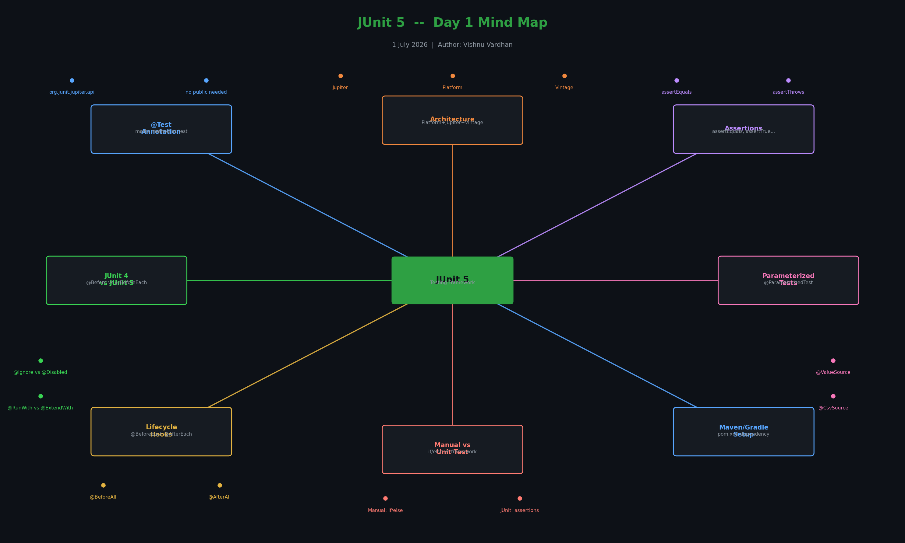
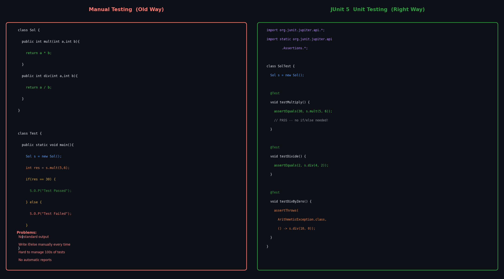
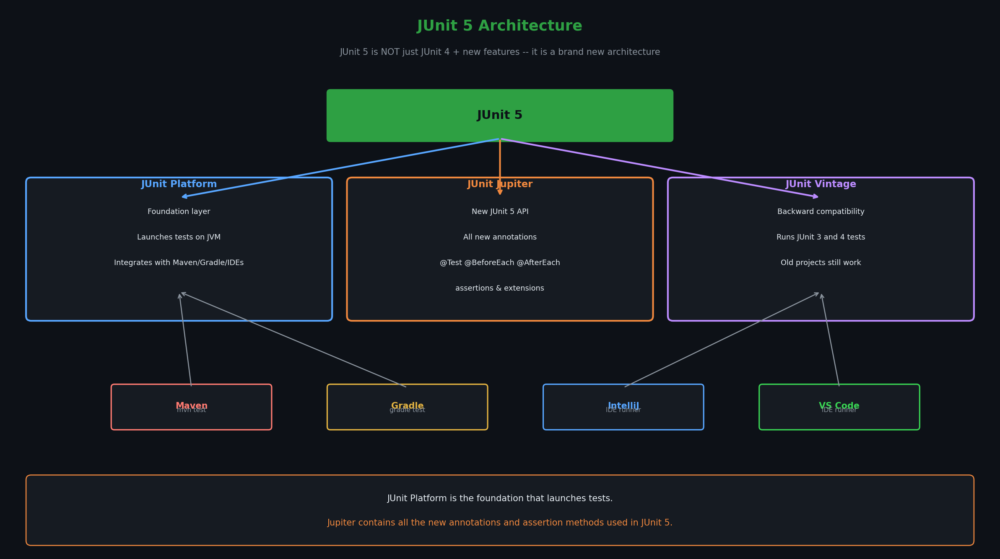
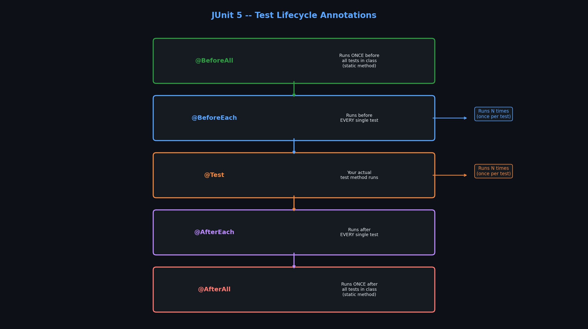
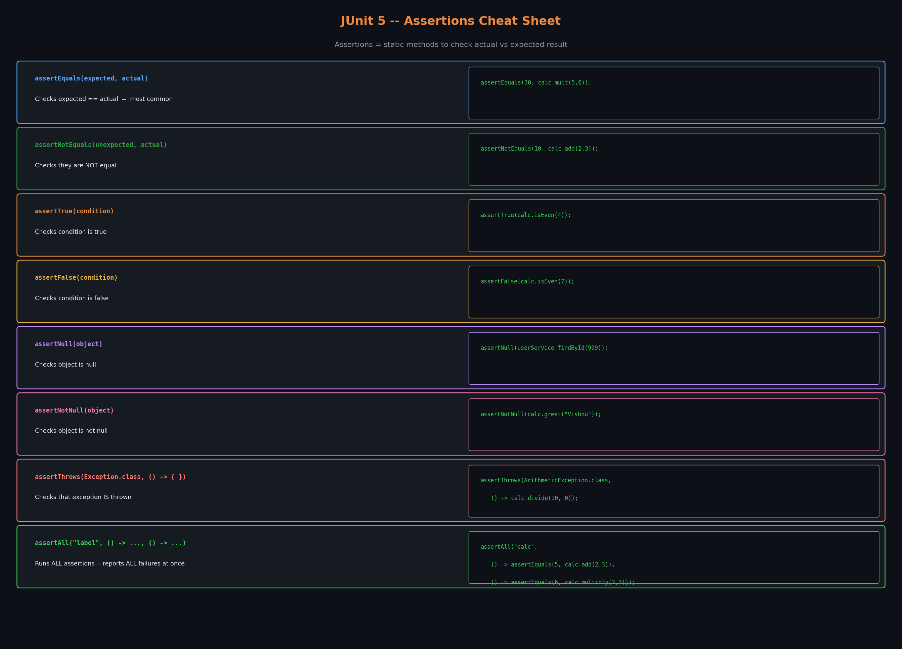
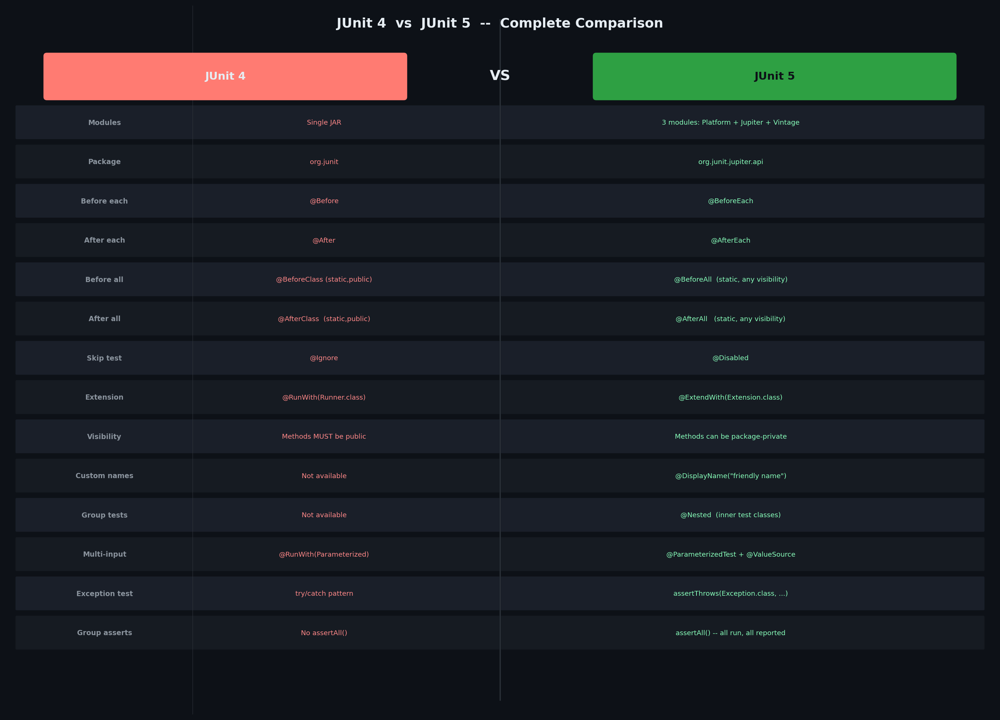

# 📗 Day 1 — JUnit 5 Testing
**Date:** 1 July 2026  
**Topic:** Manual Testing vs Unit Testing, JUnit 5 Architecture, Assertions, Annotations, JUnit 4 vs JUnit 5

---

## Mind Map — Day 1



---

> Testing is done to **ensure the application works correctly**.  
> In big organizations, there are dedicated **Test Engineers** whose only job is testing.

### Two types of testing:

| Type | Who does it | When | Scope |
|------|------------|------|-------|
| **Application Testing** | Test Engineers | After full app is built | Entire application |
| **Unit Testing** | Developer himself | **While developing** | Small parts — methods, classes |

> Key rule: The developer **who wrote the code** tests it himself using unit testing.  
> You don't wait for the entire app to be built — you test **while you build**.

---

## 2️⃣ Manual Testing vs Unit Testing



### Manual Testing (old way)

You write a **separate class** just to call your method and check output yourself:

```java
// Sol.java — your actual class
class Sol {
    public int mult(int a, int b) {
        return a * b;
    }

    public int div(int a, int b) {
        return a / b;
    }
}

// Test.java — manual test class (old way)
class Test {
    public static void main(String[] args) {
        Sol s = new Sol();

        // Test multiply
        int res = s.mult(5, 6);
        if (res == 30) {
            System.out.println("Test is Passed");
        } else {
            System.out.println("Test is Failed");
        }

        // Test divide
        int res1 = s.div(4, 3);  // Note: int division → 4/3 = 1
        if (res1 == 2) {
            System.out.println("Test is Passed");
        } else {
            System.out.println("Test is Failed");
        }
    }
}
```

### Problems with Manual Testing:
- You write **if/else** yourself every time — repetitive
- No standard output — just `System.out.println`
- Hard to manage 100s of tests
- No automatic reports
- **No framework** — everything from scratch

---

## 3️⃣ Unit Testing Framework — What it provides

A **Unit Testing Framework** like JUnit does these 6 steps for you automatically:

```
1. Prepare   → Set up test environment, write test methods
2. Provide   → Provide testing input (test data)
3. Run       → Run the test automatically
4. Provide   → Provide expected output
5. Assert    → Perform assertion — verify the result
6. Report    → Report test results (alert developer if test failed or passed)
```

> JUnit automates all of this — you just write the test logic, JUnit does the rest.

---

## 4️⃣ JUnit 5 Architecture



> **JUnit 5 is NOT just JUnit 4 + new features.**  
> It is a **completely new architecture** with 3 modules.

```
                    ┌─────────────────────────┐
                    │       JUnit 5           │
                    └────────────┬────────────┘
                                 │
           ┌─────────────────────┼──────────────────────┐
           │                     │                      │
    ┌──────▼──────┐      ┌───────▼──────┐      ┌───────▼──────┐
    │  JUnit      │      │   JUnit      │      │   JUnit      │
    │  Platform   │      │  Vintage     │      │  Jupiter     │
    └─────────────┘      └─────────────┘      └─────────────┘
   Launches tests        Runs JUnit 3 & 4      New JUnit 5
   on the JVM            tests (backward       annotations &
   (foundation)          compatibility)        API (main one)
```

| Module | Role |
|--------|------|
| **JUnit Platform** | The foundation — launches tests, integrates with Maven/Gradle/IDEs |
| **JUnit Jupiter** | The API that contains all new JUnit 5 annotations (`@Test`, `@BeforeEach`, etc.) |
| **JUnit Vintage** | Runs old JUnit 3 and JUnit 4 tests so existing code doesn't break |

> The **API** (Jupiter) is born using JUnit 5 Platform.  
> It contains **all the methods for assertions, annotations**.

---

## 5️⃣ @Test Annotation



```java
@Test   // ← applied over methods to mark method as test
public void testMultiply() {
    // test code here
}
```

**Rules for @Test methods:**
- Applied over methods to **mark a method as a test**
- Uses: `org.junit.jupiter.api` (JUnit 5 package)
- Visibility of `@Test` annotated method can be **public** (default is also fine in JUnit 5)
- Protected / default visibility is also acceptable
- Also, informs the **test engine which method needs to run**
- The **success is the default behavior** of test — it will run
- Only checks for **errors** — if no errors, by default it will give **green (pass)**

---

## 6️⃣ Assertions



> **Assertions = static methods** used to **check the actual result** against the expected result.

### Key Assertion Methods:

| Method | What it does |
|--------|-------------|
| `assertEquals(expected, actual)` | Checks if expected == actual |
| `assertNotEquals(unexpected, actual)` | Checks they are NOT equal |
| `assertTrue(condition)` | Checks condition is true |
| `assertFalse(condition)` | Checks condition is false |
| `assertNull(object)` | Checks object is null |
| `assertNotNull(object)` | Checks object is not null |
| `assertThrows(Exception.class, () -> {...})` | Checks that exception is thrown |
| `assertAll(...)` | Runs all assertions even if one fails |

---

## 7️⃣ Complete JUnit 5 Code Examples

### Example 1: Basic Calculator Test (from your notes)

```java
// Calculator.java — the class we want to test
public class Calculator {
    public int divide(int a, int b) {
        return a / b;
    }
}
```

```java
// CalcTest.java — JUnit 5 test class
import org.junit.jupiter.api.Test;
import static org.junit.jupiter.api.Assertions.*;

public class CalcTest {

    @Test
    public void testDivide() {
        Calc c = new Calc();
        int actual = c.divide(10, 5);   // 10 / 5 = 2
        int expectedResult = 2;
        assertEquals(expectedResult, actual);  // PASS if 2 == 2
    }
}
```

---

### Example 2: String Reversal Test (from your notes)

```java
// ReverseString.java — production class
public class ReverseString {
    public String reverse(String input) {
        return new StringBuilder(input).reverse().toString();
    }

    public boolean multipleWords(String input) {
        return input.contains(" ");
    }
}
```

```java
// ReverseStringTest.java — JUnit 5 test
import org.junit.jupiter.api.Test;
import static org.junit.jupiter.api.Assertions.*;

class ReverseStringTest {

    ReverseString reverse = new ReverseString();

    @Test
    void testReverseString() {
        // "avaJ" reversed should be "Java"
        assertEquals("avaJ", reverse.reverse("Java"));
    }

    @Test
    void testReverseStringFull() {
        // "Java is easy" reversed = "ysae si avaJ"
        assertEquals("ysae si avaJ", reverse.reverse("Java is easy"));
    }

    @Test
    void testMultipleWords() {
        // "Java is easy" contains a space → true
        assertTrue(reverse.multipleWords("Java is easy"));
        // "Java" has no space → false
        assertFalse(reverse.multipleWords("Java"));
    }
}
```

---

### Example 3: Full Calculator — All Assertion Types

```java
// Calculator.java
public class Calculator {
    public int add(int a, int b)      { return a + b; }
    public int subtract(int a, int b) { return a - b; }
    public int multiply(int a, int b) { return a * b; }
    public int divide(int a, int b)   { return a / b; }
    public boolean isEven(int n)      { return n % 2 == 0; }
    public String greet(String name)  { return "Hello, " + name; }
}
```

```java
// CalculatorTest.java — JUnit 5 tests with ALL assertion types
import org.junit.jupiter.api.*;
import static org.junit.jupiter.api.Assertions.*;

@DisplayName("Calculator Test Suite")
class CalculatorTest {

    Calculator calc;

    @BeforeEach          // runs BEFORE every single test method
    void setUp() {
        calc = new Calculator();
        System.out.println("Calculator created");
    }

    @AfterEach           // runs AFTER every single test method
    void tearDown() {
        System.out.println("Test done");
    }

    @BeforeAll           // runs ONCE before ALL tests in this class
    static void initAll() {
        System.out.println("=== Starting Calculator Tests ===");
    }

    @AfterAll            // runs ONCE after ALL tests in this class
    static void finishAll() {
        System.out.println("=== All Calculator Tests Done ===");
    }

    // ── assertEquals ──────────────────────────────────────────
    @Test
    @DisplayName("Addition should return correct sum")
    void testAdd() {
        assertEquals(8, calc.add(5, 3));      // 5+3 = 8 ✓
        assertEquals(0, calc.add(0, 0));      // 0+0 = 0 ✓
        assertEquals(-2, calc.add(-5, 3));    // -5+3 = -2 ✓
    }

    // ── assertNotEquals ───────────────────────────────────────
    @Test
    void testSubtractNotEqual() {
        assertNotEquals(10, calc.subtract(5, 3));  // 5-3=2, NOT 10 ✓
    }

    // ── assertTrue / assertFalse ──────────────────────────────
    @Test
    void testIsEven() {
        assertTrue(calc.isEven(4));    // 4 is even → true ✓
        assertFalse(calc.isEven(7));   // 7 is odd  → false ✓
    }

    // ── assertThrows ──────────────────────────────────────────
    @Test
    @DisplayName("Divide by zero should throw ArithmeticException")
    void testDivideByZero() {
        // We EXPECT this to throw ArithmeticException
        assertThrows(ArithmeticException.class, () -> {
            calc.divide(10, 0);   // This will throw exception
        });
    }

    // ── assertNull / assertNotNull ────────────────────────────
    @Test
    void testGreetNotNull() {
        String result = calc.greet("Vishnu");
        assertNotNull(result);                    // result is not null ✓
        assertEquals("Hello, Vishnu", result);    // content is correct ✓
    }

    // ── assertAll: runs ALL assertions even if one fails ─────
    @Test
    void testMultipleAssertions() {
        assertAll("all calculator checks",
            () -> assertEquals(10, calc.add(7, 3)),
            () -> assertEquals(4,  calc.subtract(9, 5)),
            () -> assertEquals(12, calc.multiply(3, 4)),
            () -> assertEquals(5,  calc.divide(10, 2))
        );
    }

    // ── @Disabled: skip a test temporarily ───────────────────
    @Test
    @Disabled("Feature not implemented yet")
    void testNotYetReady() {
        assertEquals(100, calc.multiply(10, 10));
    }
}
```

---

### Example 4: Parameterized Tests (JUnit 5 exclusive)

```java
import org.junit.jupiter.params.ParameterizedTest;
import org.junit.jupiter.params.provider.CsvSource;
import org.junit.jupiter.params.provider.ValueSource;
import static org.junit.jupiter.api.Assertions.*;

class ParameterizedCalcTest {

    Calculator calc = new Calculator();

    // Run same test with multiple inputs automatically
    @ParameterizedTest
    @CsvSource({
        "5, 3, 8",   // add(5,3)  = 8
        "0, 0, 0",   // add(0,0)  = 0
        "10, 5, 15", // add(10,5) = 15
        "-3, 3, 0"   // add(-3,3) = 0
    })
    void testAddWithMultipleInputs(int a, int b, int expected) {
        assertEquals(expected, calc.add(a, b));
    }

    // Check multiple even numbers
    @ParameterizedTest
    @ValueSource(ints = {2, 4, 6, 8, 100})
    void testAllEvenNumbers(int number) {
        assertTrue(calc.isEven(number));
    }
}
```

---

## 8️⃣ JUnit 4 vs JUnit 5 — Full Difference




│                  JUnit 4  vs  JUnit 5                              │
├────────────────────────┬───────────────────────────────────────────┤
│       JUnit 4          │          JUnit 5                         │
├────────────────────────┼───────────────────────────────────────────┤
│ Single JAR             │ 3 modules: Platform + Jupiter + Vintage  │
│ org.junit              │ org.junit.jupiter.api                    │
│ @Before                │ @BeforeEach                              │
│ @After                 │ @AfterEach                               │
│ @BeforeClass           │ @BeforeAll                               │
│ @AfterClass            │ @AfterAll                                │
│ @Ignore                │ @Disabled                                │
│ @RunWith(...)          │ @ExtendWith(...)                         │
│ Methods MUST be public │ Methods can be package-private (default) │
│ No @DisplayName        │ @DisplayName("friendly name")            │
│ No @Nested tests       │ @Nested (group tests inside classes)     │
│ No Parameterized API   │ @ParameterizedTest + @ValueSource etc    │
│ No assertThrows()      │ assertThrows() built-in                  │
│ No assertAll()         │ assertAll() — run all, report all fails  │
│ Runners for extension  │ Extension model (cleaner)                │
└────────────────────────┴───────────────────────────────────────────┘
```

### Side-by-side code comparison:

```java
// ─── JUnit 4 ───────────────────────────────────────
import org.junit.Test;
import org.junit.Before;
import org.junit.After;
import org.junit.BeforeClass;
import org.junit.AfterClass;
import org.junit.Ignore;
import static org.junit.Assert.*;

public class CalcTestJUnit4 {

    @BeforeClass
    public static void initAll() { }     // static, public required

    @AfterClass
    public static void finishAll() { }

    @Before
    public void setUp() { }              // public required

    @After
    public void tearDown() { }

    @Test
    public void testAdd() {              // public required
        assertEquals(8, 5 + 3);
    }

    @Ignore("not ready")
    @Test
    public void skippedTest() { }
}
```

```java
// ─── JUnit 5 ───────────────────────────────────────
import org.junit.jupiter.api.*;
import static org.junit.jupiter.api.Assertions.*;

class CalcTestJUnit5 {

    @BeforeAll
    static void initAll() { }            // static, but NOT required to be public

    @AfterAll
    static void finishAll() { }

    @BeforeEach
    void setUp() { }                     // no public required

    @AfterEach
    void tearDown() { }

    @Test
    @DisplayName("Addition works correctly")
    void testAdd() {                     // no public required
        assertEquals(8, 5 + 3);
    }

    @Disabled("not ready")
    @Test
    void skippedTest() { }

    // EXTRA JUnit 5 features — not available in JUnit 4:

    @Test
    void testException() {
        assertThrows(ArithmeticException.class, () -> {
            int x = 10 / 0;
        });
    }

    @ParameterizedTest
    @ValueSource(ints = {2, 4, 6})
    void testEven(int n) {
        assertEquals(0, n % 2);
    }

    @Nested
    @DisplayName("Multiply Tests")
    class MultiplyTests {
        @Test
        void positiveNumbers() {
            assertEquals(12, 3 * 4);
        }
        @Test
        void negativeNumbers() {
            assertEquals(-12, -3 * 4);
        }
    }
}
```

---

## 9️⃣ Maven Dependency to Add JUnit 5

```xml
<!-- In pom.xml -->
<dependencies>
    <dependency>
        <groupId>org.junit.jupiter</groupId>
        <artifactId>junit-jupiter</artifactId>
        <version>5.10.0</version>
        <scope>test</scope>
    </dependency>
</dependencies>

<build>
    <plugins>
        <plugin>
            <groupId>org.apache.maven.plugins</groupId>
            <artifactId>maven-surefire-plugin</artifactId>
            <version>3.1.2</version>
        </plugin>
    </plugins>
</build>
```

### Gradle (Groovy DSL)
```groovy
dependencies {
    testImplementation 'org.junit.jupiter:junit-jupiter:5.10.0'
}
test {
    useJUnitPlatform()
}
```

### Gradle (Kotlin DSL)
```kotlin
dependencies {
    testImplementation("org.junit.jupiter:junit-jupiter:5.10.0")
}
tasks.test {
    useJUnitPlatform()
}
```

---

## 🔑 Quick Reference Card

| Annotation | JUnit 4 | JUnit 5 |
|------------|---------|---------|
| Mark test | `@Test` | `@Test` |
| Before each test | `@Before` | `@BeforeEach` |
| After each test | `@After` | `@AfterEach` |
| Before all tests | `@BeforeClass` | `@BeforeAll` |
| After all tests | `@AfterClass` | `@AfterAll` |
| Skip test | `@Ignore` | `@Disabled` |
| Custom name | — | `@DisplayName` |
| Run multiple inputs | `@RunWith(Parameterized)` | `@ParameterizedTest` |
| Extension | `@RunWith` | `@ExtendWith` |

| Command | What it runs |
|---------|-------------|
| `mvn test` | Compiles + runs all tests |
| `gradle test` | Compiles + runs all tests |
| `mvn -Dtest=CalcTest test` | Runs only CalcTest |

---

*📅 Tomorrow: More JUnit 5 concepts — Mocking with Mockito...*
