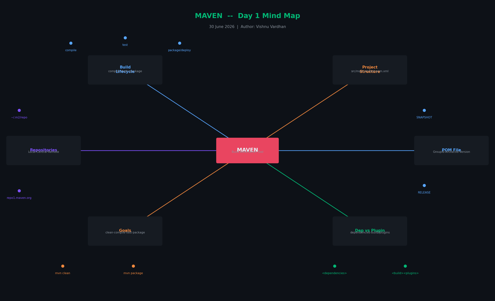
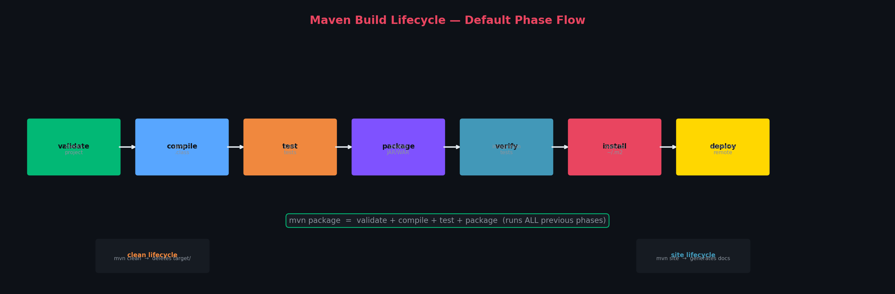

# 📗 Day 2 — POM.xml & Maven Build Lifecycle
**Date:** 1 July 2026  
**Topic:** pom.xml deep dive, Effective POM, Maven Build Lifecycle

---

## Mind Map



---

## 1️⃣ pom.xml — Project Object Model

**pom.xml** is a **configuration file** — it is the heart of every Maven project.

Think of it like this:

> 🍕 If your project is a pizza order, `pom.xml` is the **order form** that tells Maven:
> - What ingredients (dependencies) to get
> - How to cook it (build plugins)
> - What size (version/packaging) to make

### What it contains:
```xml
<?xml version="1.0" encoding="UTF-8"?>
<project>
    <groupId>com.vishnu</groupId>         <!-- Who owns this project -->
    <artifactId>vishnu-app</artifactId>   <!-- Project name -->
    <version>1.0-SNAPSHOT</version>       <!-- Version -->
    <packaging>jar</packaging>            <!-- Output type -->

    <dependencies>
        <!-- Libraries your code needs -->
    </dependencies>

    <build>
        <plugins>
            <!-- Tools Maven uses to build -->
        </plugins>
    </build>
</project>
```

---

## 2️⃣ Effective POM

### What is Effective POM?

> **Effective POM** is the **final POM** generated by Maven **after merging**:
> - Your `pom.xml` (written by you)
> - The **Parent POM** (from parent project, if any)
> - The **Super POM** (Maven's built-in default POM)

### Simple Analogy:
```
Your pom.xml         +    Parent pom.xml    +    Super POM (Maven default)
(your settings)           (company defaults)     (Maven's defaults)
        │                        │                       │
        └────────────────────────┴───────────────────────┘
                                 │
                                 ▼
                         EFFECTIVE POM
                    (what Maven actually uses)
```

### Why it matters:
- Maven uses the **Effective POM internally** to build the project
- It **inherits configurations**, dependency management, and default plugin settings from parent POMs
- You can view it with:
```bash
mvn help:effective-pom
```

### Real Example:
You write in your `pom.xml`:
```xml
<version>1.0-SNAPSHOT</version>
```
The **Super POM** already has defaults like:
```xml
<directory>${project.basedir}/target</directory>
<sourceDirectory>src/main/java</sourceDirectory>
```
Your Effective POM **combines both** — so you get all the defaults + your custom settings.

---

## 3️⃣ Maven Build Lifecycle

Maven has **3 built-in lifecycles**:

| Lifecycle | Purpose |
|-----------|---------|
| `default` | Main lifecycle — builds your application (most used) |
| `clean` | Cleans the `target/` directory |
| `site` | Generates project documentation |

---

### Default Build Lifecycle (Most Important)



| Phase | What it does |
|-------|-------------|
| `validate` | Checks the project is correct and all info is available |
| `compile` | Compiles `.java` source code into `.class` bytecode |
| `test` | Runs unit tests using JUnit (won't package if tests fail) |
| `package` | Packages compiled code into JAR or WAR file |
| `verify` | Runs integration tests to check quality |
| `install` | Copies the JAR/WAR to your local `~/.m2` repository |
| `deploy` | Uploads the JAR/WAR to a remote repository |

> ⚡ **Important:** Each phase runs all previous phases too!
> `mvn package` = validate + compile + test + package

### Clean Lifecycle
```bash
mvn clean    # Deletes the target/ folder (removes old compiled files)
```

### Site Lifecycle
```bash
mvn site     # Generates HTML documentation for your project
```

---

## 4️⃣ Quick Reference

```bash
# See the full effective POM Maven uses internally
mvn help:effective-pom

# Run default lifecycle up to package
mvn package

# Clean old files + repackage (most common combo)
mvn clean package

# Install to local repo
mvn install
```

---

*📅 Next: Gradle Build Tool*
